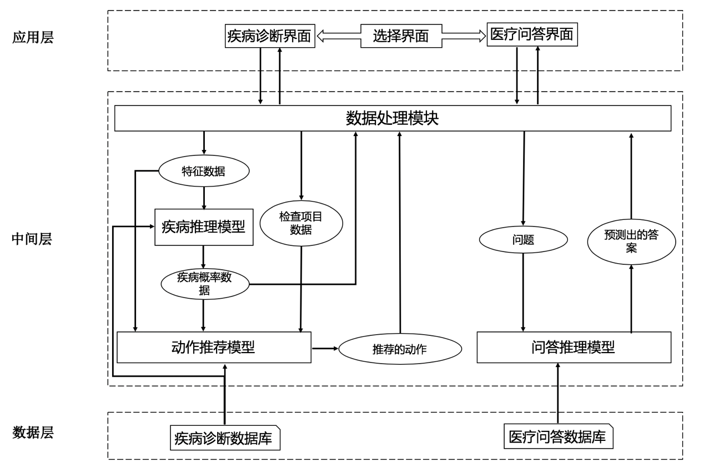
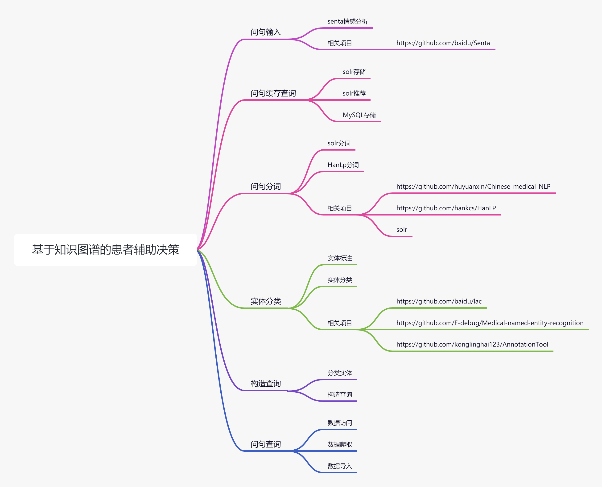

# 工程简介

## 模块介绍

* knowledge-admin 后台数据管理模块
* knowledge-base-dep 依赖管理模块
* knowledge-common 公共模块
* knowledge-disease-diagnosis 疾病诊断模块
* knowledge-question-and-answer 智能问答模块
* knowledge-starter 项目启动模块

## 技术选型

### 项目结构

```
├─doc
│  └─img
├─knowledge-admin
│  └─src
│      └─main
│          ├─java
│          │  └─org
│          │      └─graduation
│          │          └─knowledge
│          │              ├─controller
│          │              ├─mapper
│          │              ├─model
│          │              └─service
│          └─resources
│              └─mybatis
│                  └─neo4j
├─knowledge-base-dep
├─knowledge-common
│  ├─src
│  │  └─main
│  │      └─java
│  │          └─org
│  │              └─graduation
│  │                  └─knowledge
│  │                      ├─base
│  │                      └─util
│  └─target
│      ├─classes
│      │  └─org
│      │      └─graduation
│      │          └─knowledge
│      │              ├─base
│      │              └─util
│      ├─generated-sources
│      │  └─annotations
│      ├─generated-test-sources
│      │  └─test-annotations
│      └─test-classes
│          └─org
│              └─graduation
│                  └─knowledge
├─knowledge-disease-diagnosis
│  └─src
│      └─main
│          ├─java
│          │  └─org
│          │      └─graduation
│          │          └─knowledge
│          │              ├─controller
│          │              ├─mapper
│          │              ├─model
│          │              └─service
│          └─resources
│              └─mybatis
│                  └─neo4j
├─knowledge-question-and-answer
│  ├─src
│  │  └─main
│  │      ├─java
│  │      │  └─org
│  │      │      └─graduation
│  │      │          └─knowledge
│  │      │              ├─controller
│  │      │              ├─factory
│  │      │              ├─mapper
│  │      │              │  ├─mysql
│  │      │              │  └─neo4j
│  │      │              │      ├─node
│  │      │              │      └─relation
│  │      │              ├─model
│  │      │              │  ├─node
│  │      │              │  └─relation
│  │      │              └─service
│  │      │                  └─impl
│  │      └─resources
│  │          └─mybatis
│  │              ├─mysql
│  │              └─neo4j
│  │                  ├─node
│  │                  └─relation
│  └─target
│      ├─classes
│      │  ├─mybatis
│      │  │  └─neo4j
│      │  │      ├─node
│      │  │      └─relation
│      │  └─org
│      │      └─graduation
│      │          └─knowledge
│      │              ├─controller
│      │              ├─factory
│      │              ├─mapper
│      │              │  ├─mysql
│      │              │  └─neo4j
│      │              │      ├─node
│      │              │      └─relation
│      │              ├─model
│      │              │  ├─node
│      │              │  └─relation
│      │              └─service
│      │                  └─impl
│      ├─generated-sources
│      │  └─annotations
│      ├─generated-test-sources
│      │  └─test-annotations
│      └─test-classes
└─knowledge-starter
    ├─src
    │  ├─main
    │  │  ├─java
    │  │  │  └─org
    │  │  │      └─graduation
    │  │  │          └─knowledge
    │  │  │              ├─aop
    │  │  │              └─config
    │  │  └─resources
    │  │      └─META-INF
    │  └─test
    │      └─java
    │          └─org
    │              └─graduation
    │                  └─knowledge
    │                      ├─answer
    │                      │  └─mapper
    │                      │      └─node
    │                      └─common
    │                          └─util
    └─target
        ├─classes
        │  ├─META-INF
        │  └─org
        │      └─graduation
        │          └─knowledge
        │              ├─aop
        │              └─config
        ├─generated-sources
        │  └─annotations
        ├─generated-test-sources
        │  └─test-annotations
        └─test-classes
            └─org
                └─graduation
                    └─knowledge
                        ├─answer
                        │  └─mapper
                        │      └─node
                        └─common
                            └─util
```

### 前端

* Vue-Element-Admin

### 后端

* Spring Boot 2.3.0+
* MySQL 5.7+
* Neo4j 4.2.1+
* Solr 7.3.0+

### 项目架构



### 处理流程



### 基本功能

* 知识问答
* 疾病分析

# 延伸阅读

相关依赖的软件

```
链接：https://pan.baidu.com/s/1I9GG4zD2rULAKA6Mb365LQ 
提取码：MKGS 
```